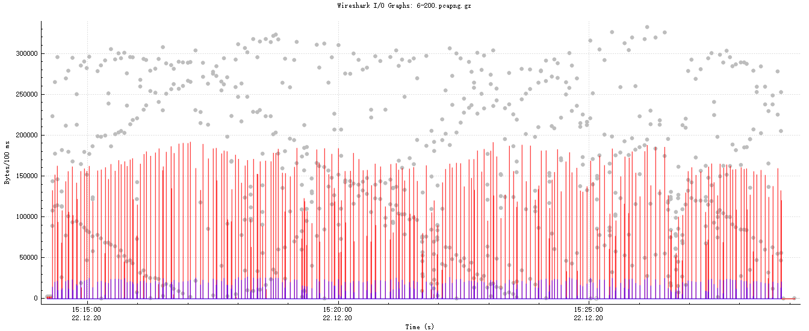

# FedTruthFinderImpl

An implementation of FedTruthFinder.

# Architecture

## Roles


* master server: just performs as the *'server'* in the paper.
* slave server: listening in the background of *'clients'* in the paper, handling calls from the master server and the raw event sender installed alongside it.
* raw event sender: a client-side adapter for slave server, changing detected events into identifiers and sending them to its background slave server.

Communications among these crates are completed by [tonic](https://github.com/hyperium/tonic), a [gRPC](https://grpc.io/) client & server implementation in [Rust](https://www.rust-lang.org/). The protobuf file is [here](./proto/algo.proto) so you can implement any half without implementing the other side.

## General Architecture


## For Test


# Configuration

## Master Configuration

A master configuration is a json file following such scheme:

```json
{
    "addr": "[::1]:50050",
    "keys": {
        "ca_path": "config/tls/client_ca.pem",
        "sk_path": "config/tls/server.key",
        "pk_path": "config/tls/server.pem"
    },
    "group_num": 3
}
```

* `addr`: the IP address and port that it will listen on
* `group_num`: the number of groups which should be an odd number (not less than 3).
* `keys`: reserved


## Slave Configuration

A slave configuration is a json file following such scheme:

```json
{
    "addrs": {
        "domain_name": "localhost",
        "remote_addr": "http://[::1]:50050",
        "mailbox_addr": "[::1]:50051"
    },
    "keys": {
        "sk_path": "config/tls/client1.key",
        "pk_path": "config/tls/client1.pem",
        "ca_path": "config/tls/ca.pem"
    },
    "error_rate": 0.25
}
```

* `addrs`
  * `remote_addr`: the url of its master
  * `mailbox_addr`: the IP address and port that it will listen on
  * `domain_name`: reserved
* `error_rate`: assuming that one event can be judged as `True` or `False` and `True` is the *'fact'*, the possibility that the slave judge a event as `False`
* `keys`: reserved

## Raw Event Broadcaster

### Listener List

Urls listed in lines.
Raw event broadcaster use these urls to dispatch event identifier to slaves.

For instance:

```
http://[::1]:50051
http://[::1]:50052
http://[::1]:50053
http://[::1]:50054
http://[::1]:50055
http://[::1]:50056
```

### Raw Event Records

Raw event records are provided through a csv file following such scheme:

```csv
identifier,delay_seconds
1,3
2,3
3,5
4,5
...,...
```

* `identifier`: A string that can universally represents an event. Events that can result in the same identifier should be considered as the same.
* `delay_seconds`: A positive number that indicates the internal after the next event.

# Usage

## Preliminary

### Rust Language

1. install rust language, here's an [instruction](https://www.rust-lang.org/tools/install). It would help if you learnt a little bit about usages of `cargo`, the biuld & package management tool of rust language.
1. git clone this repository.
1. cd into this repository and install crates with `cargo install --path . --bins`.

**note**: You'd better check if `$HOME/.cargo/bin` is in your `$PATH` (system environment variable), or may not be able to run the programs installed on the previous step.

### A Network Protocol Analyzer

For instance, [wireshark](https://www.wireshark.org/).

## Generate Data Packages

### generate configurations

First, copy configuration template files (i.e., the `config` directory) to the directory where you will run tests.
Then, run a command following such pattern:

```shell
configuration_generator slave_num master_configuration_template_path slave_configuration_template_path
```

* slave_num: The number of slaves should be no less than the group_num in master configuration. Temporarily, this value should not exceed 255 due to a limitation from one of our dependencies. 
* master_configuration_template_path: The path of master configuration template.
* slave_configuration_template_path: The path of slave configuration template.

For instance, run `configuration_generator 6 ./config/master_template.json ./config/slave_template.json`. This will result in one master configuration file and six slave configuration files and one listener list text file. All of these will be stored in `./config` directory.

### start to capture

Take wireshark as an example. Since all the transmissions of these programs are based on tcp,
you can assign a packet filter like `tcp portrange 50050-50057`.


### master

Enter this line in your cmd/shell to run the *master*:

```shell
master config_path[, log_path]
```

* `config_path`: Path of the configuration file
* `log_path`(optional): Expected file path of output logs. If not specified, log will be output to your current terminal. However, this is not recommended because the output may be too long to avoid dropping by the terminal which means that you may loss some logs.

For instance, `master ./config/master.json ./result/master.log`.

**WARN**: Existing log files will be overwritten.

### slaves

Enter this line in your cmd/shell to run a *slave*:

```shell
slave config_path[, log_path]
```

`config_path` and `log_path` here have the same meanings as in [run master](#master). 

For instance, `slave ./config/slave_1.json ./result/slave_1.log`.

**WARN**: Existing log files will be overwritten.

### run raw event broadcaster

Enter this line in your cmd/shell to run a *raw event broadcaster*:

```shell
raw_event_broadcaster event_num_limitation listeners_url_path event_data_path
```

* `event_num_limitation`: a positive integer, the allowed maximum number of events' raw records
* `listeners_url_path`: the path of urls file of event listeners
* `event_data_path`: the path of raw event data file

For instance, `raw_event_broadcaster 200 config\listeners.txt config\event\raw_event_records_1000.csv`.

### end the capture

After having logged the last line (where the `eid` equals to min(the record maximum limit, the length of provided raw events)), the raw event broadcaster ends itself. Then, after about 3 seconds, you can:

1. kill the master;
1. kill the slaves;
1. stop capturing network packets and save them if needed.

### 🥳Automation

Here we provide a [powershell](https://docs.microsoft.com/en-us/powershell/scripting/install/installing-powershell?view=powershell-7.1) script to automate above test process. You can copy the [script](./run_test.ps1) to a directory where exists `config` directory and run it like this:

```powershell
./run_test.ps1 6 200
```

And then you can go ahead and collect network packages.

Its general usage pattern looks like:

```powershell
./run_test.ps1 client_num raw_event_record_num_limitation
```

More configurable test parameters will be added in the future.

## Example Result

If you have followed all the instructions above or just have run the automatic testing script we 
provide, you may get a result similar with the example one restored in `./result` where you can find:

* [a wireshark packet set](./result/6-200.zip) (you have to unzip it first)
* six slave log files named like `slave_x.log`
* a master log file named `master.log`

Here's a flow chart of this process, exported from wireshark.



Its corresponding data is [here](./result/6-200.csv). With this data, we can figure out the total flow of this whole process (200 rounds).

|                            | All       | Master   | Slave 1 |
|----------------------------|-----------|----------|---------|
| Total Amount \(byte\)      | 111921739 | 66160613 | 7955648 |

We can figure out such estimations:

* an approximate amount of data transmitted through *master* in one iteration per slave: 55,134 B, i.e. 53.84 KB
* an approximate amount of data transmitted through one *slave* in one iteration: 39,778 B, i.e. 38.85 KB

*Note*: Since slaves are similar, here we just provide the data amount of slave_1 (in most cases, other slaves' data amount should be no bigger than the slave_1's). If you are interested in the other slaves', you can utilize [the network packet set](./result/6-200.zip).
