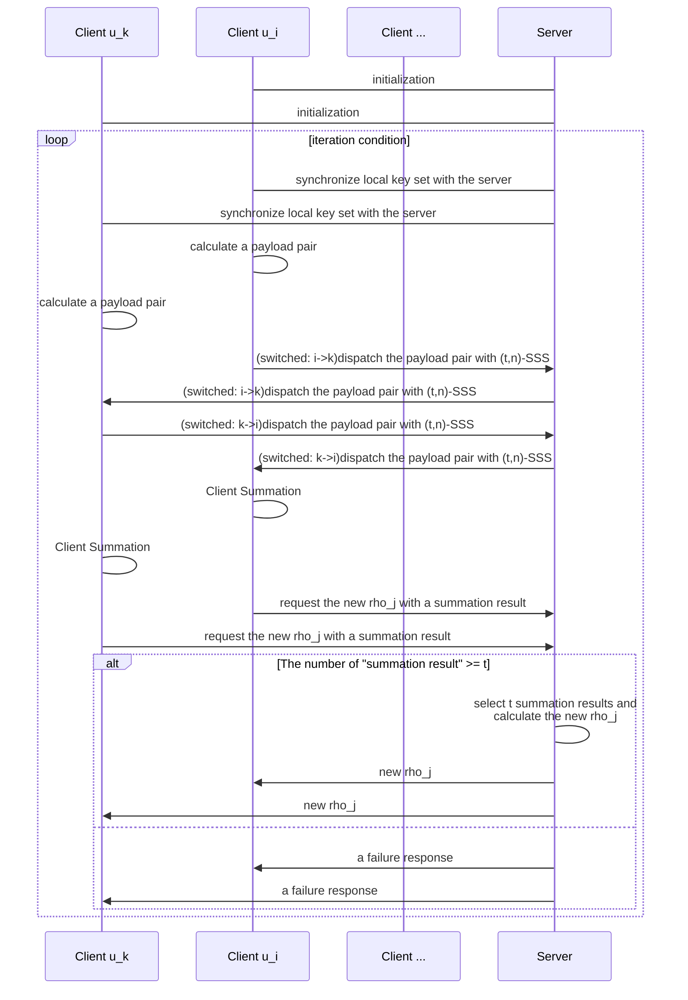
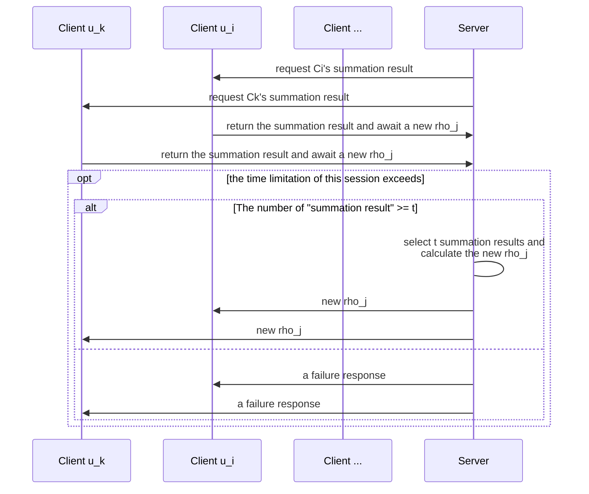
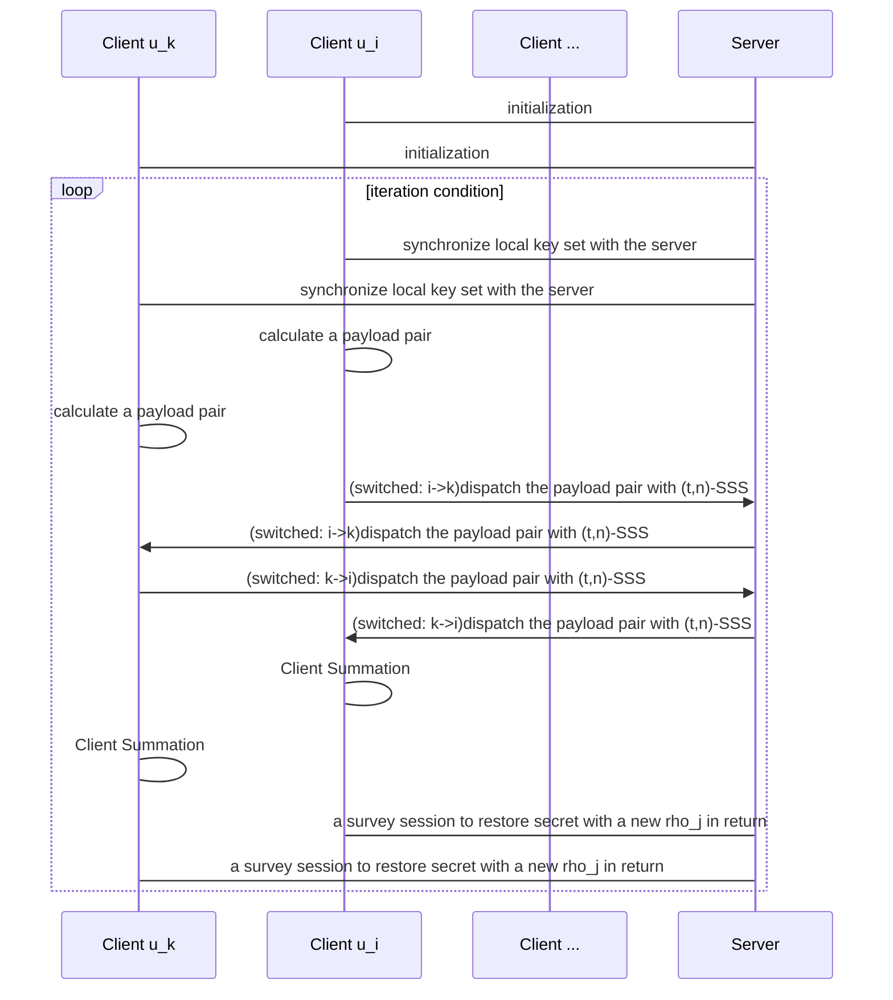
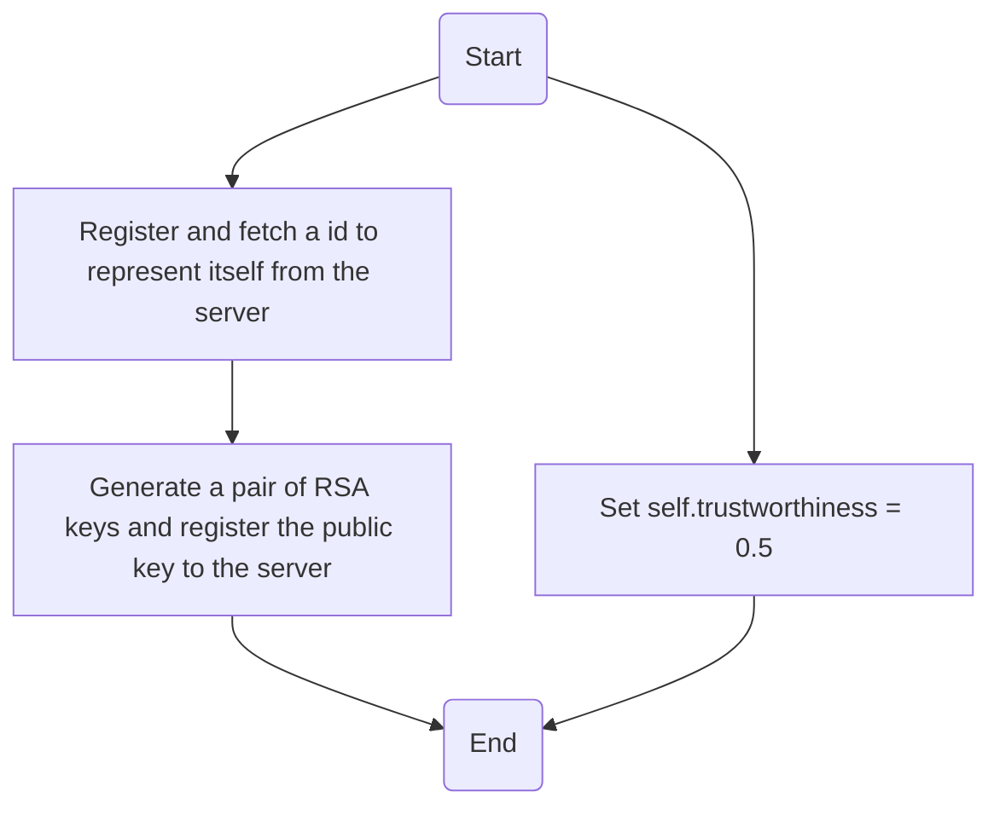
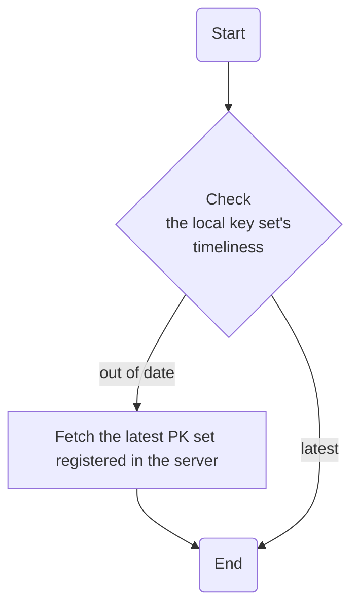
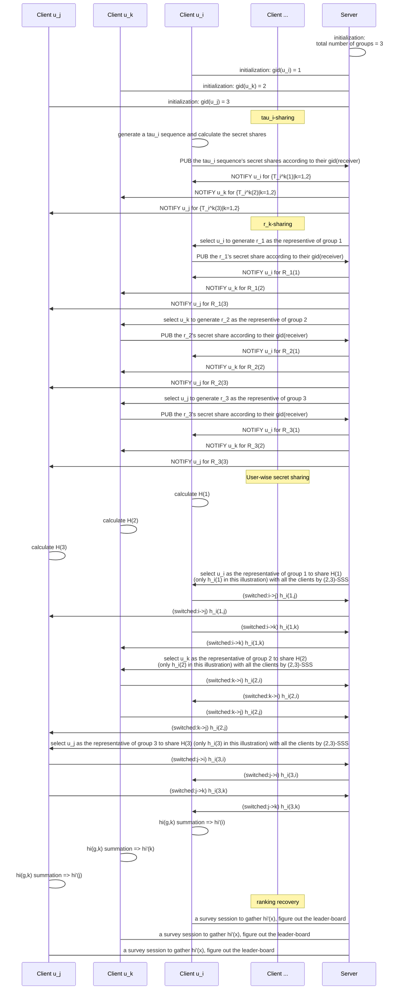
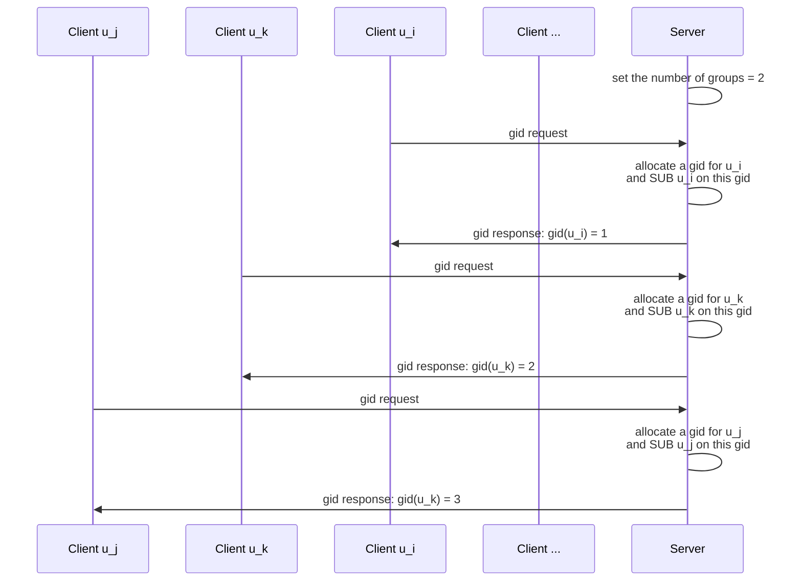

# Event Confidence Computation with SSS

## Function Points Analysis

### Data Preparations

When a new *event* $e_j$ is sensed by a *client* $u_i$, it first calculates(or initializes) $\tau_i$ with:
$$
\tau_i = \begin{cases}
    1 / 2 & \text{$u_i$ just joined the network for the first time} \\
    \frac{
        \sum_{e_j \in \mathcal{E}_{i,1}} \rho_j + \sum_{e_k \in \mathcal{E}_{i,0}}(1-\rho_k)
    }{
        |\mathcal{E}_{i,1}| + |\mathcal{E}_{i,0}|
    } & \text{otherwise}
\end{cases}
$$
Then, it begins a **$\tau-\rho$ iteration**. Firstly, it calculates $(d_{ij}, s_{ij})$ from $e_j$ according to:
$$
d_{ij} = \begin{cases}
    \tau_i & {e_j \in \mathcal{E}_{i,0}} \\
    1- \tau_i & {e_j \in \mathcal{E}_{i,1}} \\
    0 & {e_j \in \mathcal{E} \setminus (\mathcal{E}_{i,1} \cup \mathcal{E}_{i,0})}
\end{cases}
$$

$$
s_{ij} = \begin{cases}
    1 & {e_j \in \mathcal{E}_{i,1} \cup \mathcal{E}_{i,0}} \\
    0 & {e_j \in \mathcal{E} \setminus (\mathcal{E}_{i,1} \cup \mathcal{E}_{i,0})}
\end{cases}
$$

After all of these, it *can* dispatch $(d_{ij}, s_{ij})$ user-wisely with (t,n)-SSS.

In this step, **users**(or, clients) should have such *function point(s)*:

1. maintain the event set $\mathcal{E}_i$ and $\tau_i$ locally for itself.

### Secret Sharing

In this step, each user shares its  $(d_{ij}, s_{ij})$ **user-wisely** by ***(t,n)-SSS***. Supposed that the payload dispatched from $u_i$ to $u_k$ is $(D_{ij}(k), S_{ij}(k))$, each user does *summations* according to the id of the **sender** (in this case, $u_i$):
$$
\hat{d_j^k} = \sum_{i=1}^{n} D_{ij}(k)
$$

$$
\hat{s_j^k} = \sum_{i = 1}^n S_{ij}(k)
$$

and sends the result $(\hat{d_j^k}, \hat{s_j^k})$ to the server. The server first awaits at least **t** request from users which contains a corresponding $(\hat{d_j^k}, \hat{s_j^k})$, then figures out $(d_j, s_j)$ by solving two multivariate linear equation groups.

In this step, **users**(or, clients) should have such *function point(s)*:

1. armed with (t,n)-SSS

The **server** should have such *function point(s)*:

1. ability to solve multivariate linear equation groups => some linear algebra library.

While ***a server-coordinated communication structure*** is utilized to reduce the complexity of P2P network and shed the load of network maintenance in the user side, **server** also should have such *function point(s)*:

1. can forward messages in a secure and confidential channel => TSL (with authentication)

And correspondingly, the **users**(or, clients) should have a *function point* to encrypt and decrypt messages. 

### Event Confidence Calculation

The crowdsensing server finally calculate the confidence $\rho_j$ of event $e_j$:
$$
\rho_j = \frac{d_j}{s_j}
$$
If the **iteration condition**[^1] is still `true`, this process would carry on from the [start](#Data Preparations).

[^1]:The iteration condition is currently uncertain. It is describe as "convergence" in $\S 2$ of FedTruthFinder.

 In this step, the crowdsensing **server** should have such *function points*:

1. find a way to return the result to clients

## Software Engineering

### Glossary

|   Terminology    | Corresponding Notation or Explanation                        |
| :--------------: | ------------------------------------------------------------ |
|       u_i        | $u_i$                                                        |
|       u_k        | $u_k$                                                        |
|      tau_i       | $\tau_i$                                                     |
|   payload pair   | $(d_{ij}, s_{ij})$ that results from [Data Preparations](#Data Preparations). |
|     switched     | When server received the a (i->k) packet from $u_i$, it should forward the packet to $u_k$. |
| Client Summation | Each client sums up received shares according to the id of the payload pairs' sender. Details in [here](#Secret Sharing). |
|      rho_j       | $\rho_j$                                                     |
| failure response | A response that indicates the server has failed to calculate the new $\rho_j$ due to *too-less-shares issue*. |

### Sequence Diagram

A less-modified version of the process can be described as follow.

However, [survey pattern](https://nanomsg.org/gettingstarted/survey.html) can be applied in the last part of iteration. Specifically, a **survey session** can be described as follows in this case.

Hence, here's another possible communication process modified with *survey pattern*.

From these diagrams, we can see that the **server** should have at least three *services*[^2]:

1. Relay: forward encrypted messages from one client to another;
1. Global <user, pk> management: identify the clients and respond to requests about clients' public keys;
1. Time-limited, survey-like information transportation.

And, **clients** should support such *service*[^2]:

1. Interface to raise the secret restoration or offer one of the secret share in (t,n)-SSS.

[^2]: Here, **service** refers to a set of interfaces of an application which provides services to the **outer** instances.

### Client Initialization

### Key Set Synchronization in the Client-side

# Secure Trustworthiness Leader-board

## Function Point Analysis

 ### Grouping

Given an odd number $(2t+1)$, every clients that entered this ranking session is divided into $(2t+1)$ groups by a currently uncertain approach.

One possible method to divide clients into groups is:

1. The number of group is *preset* in the server-side as $(2t+1)$.
1. When a client communicates with the serve for the *first* time, the server allocates a $<uid, gid>$ pair to universally identified the client, where the $uid$ represents the global id of the client and $gid$ represents the global id of group (equals to $gid(u)$ in the paper).

As a result, every group should have $\lfloor n/(2t+1) \rfloor$ or  $(\lfloor n/(2t+1)\rfloor +1)$ members, where $n$ represents the total number of the clients (or, users) at that time.

However, this method cannot let the users to has the ability to observe the others' $gid$, which means that *user selection* in the following steps cannot be taken by the users. Besides, the group setting cannot be rearranged during the runtime. This is not all bad because user selection may depend on the stability of connections between client and server other than the quantities of connections among clients under a *server-coordinated* communication architecture.

### Group-wise[^3] Secret Sharing

[^3]: Though it is named with *group-wise*, the messages shared are still received by **every** client.

Here's two parallelizable[^4] process: $\tau_i$-sharing and $r_k$-sharing.

[^4]: This means that they do not depend on the other one.

#### $\tau_i$-sharing

Each client first generates a sequence of number: $\tau_i, \tau_i^2, \cdots, \tau_i^{2t+1}$. For each one in the sequence, the client shares it with (t+1, 2t+1)-SSS to all the clients based on the receivers' $gid$. Specifically, one share of $\tau_i^k$ from $u_i$ to $u_j$ is denoted as $T_i^k(gid(u_j))$[^5].

[^5]: The original form of this notation is $\tau_{i_k}(gid(u_j))$ in the paper. To keep a uniform notation paradigm as in [Secret Sharing in Event Confidence Computation with SSS](#Secret Sharing), here I changed its representation.

#### $r_k$-sharing

To generate a sequence of *positive* random number ($r_1, r_2, \cdots, r_{2t+1}$), the server first selects one client from each group based on some metrics, e.g., $u_{i,k}$ is selected by the server from group $g_k$ because the connection stability between $u_{i,k}$ and the server is the best in group $g_k$. Then, each chosen client $u_{i,k}$ shares the positive random number $r_k$ with (t+1, 2t+1)-SSS to all the clients in every group (i.e., $u_j$ will receive a share of $r_k$ regarding $gid(u_i)$ from $u_{i,k}$, denoted as $R_k(gid(u_j))$[^6]).

[^6]: The original form of this notation is $r_k(gid(u_i))$ in the paper. Out of the same consideration as [$\tau_i$-sharing](#$\tau_i$-sharing), I changed its representation here.

### User-wise Secret Sharing

Each client $u_j$ mixes secret pieces as follows **for each clients** $u_i$ after having received *all* the required shares from $u_i$, i.e. $R_k(gid(u_j)), \forall k \in \{1, \cdots, 2t+1\}$ and $T_i^k(gid(u_j)), \forall k \in \{1, \cdots, 2t+1\}$.
$$
\begin{bmatrix}
\lambda(1) & \lambda(2) & \lambda(3) & \cdots & \lambda(2t+1) \\
\cdots &\cdots &\cdots &\cdots &\cdots &\\
\cdots &\cdots &\cdots &\cdots &\cdots &\\
\cdots &\cdots &\cdots &\cdots &\cdots &
\end{bmatrix} =
\begin{bmatrix}
1 & 1^1 & 1^2 & \cdots & 1^{2t} \\
1 & 2^1 & 2^2 &\cdots & 2^{2t}\\
\cdots &\cdots &\cdots &\cdots &\cdots &\\
1 & (2t+1)^1 & (2t+1)^2 & \cdots & (2t+1)^{2t}  
\end{bmatrix}^{-1}
$$

$$
\gamma(gid(u_j))=\sum_{k=1}^{2t+1}R_k(gid(u_j))T_i^k(gid(u_j))
$$

$$
h_i(gid(u_j)) = \lambda(gid(u_j)) \cdot \gamma(gid(u_j)
$$

After this, it can got a result set $\{h_i(gid(u_j))|i = 1, \cdots, n\}$, denoted as $\mathcal{H}(gid(u_j))$.

Then, the server chooses one client in each group in the same way as in [$r_k$-sharing](#$r_k$-sharing). The chosen clients dispatch every $h_i(gid(u_j))$ in $\mathcal{H}(gid(u_j))$ to **all the clients** with (t+1, n)-SSS. Specifically, the $\tau_i$'s mixed secret share from a chosen $u_j$ to a receiver $u_k$ is denoted as $h_i(gid(u_j),k)$. Let $g = gid(u_j)$. Because $u_j$ is chosen from every group, $g \in \{1, 2, \cdots, 2t+1\}$.

Each receiver $u_k$(every client is a receiver) do aggregations to those received mixed secret shares based on $gid$.
$$
h_i'(k) = \sum_{g=1}^{2t+1}h_i(g,k)
$$
This will result in a set $\{h_i'(k)|i=1,\cdots, n\}$, denoted as $\mathcal{H'(k)}$ which will be sent to the *server*.

### Ranking Recovery

Every $h_i$ can be restored by solving a multivariate linear equation group after the server's receiving at least $t+1$ $h_i'(k) \in \mathcal{H}'(k)$. Then, the server ranks the $u_i$ according to $h_i$, which results in a leader-board regarding $u_i$'s trustworthiness $\tau_i$.

## Software Engineering

Here a [Pub/Sub pattern](https://nanomsg.org/gettingstarted/pubsub.html) is applied to deal with some multicast scenarios like group-wise secret sharing. 

### Sequence Diagram

Out of the consideration of conciseness, only the process from $\tau_i$ to $h_i$ will be illustrated here. 

For details about *initialization* of the server and clients in secure trustworthiness leader-board, you can refer to the following diagram.

